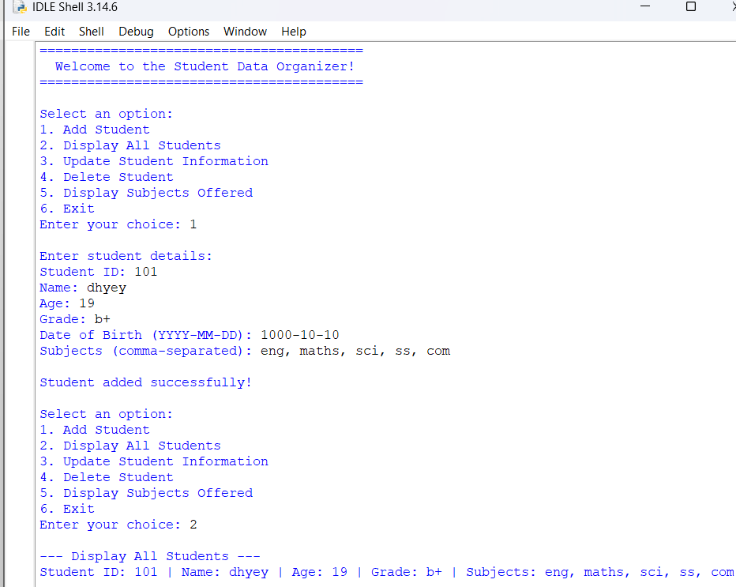
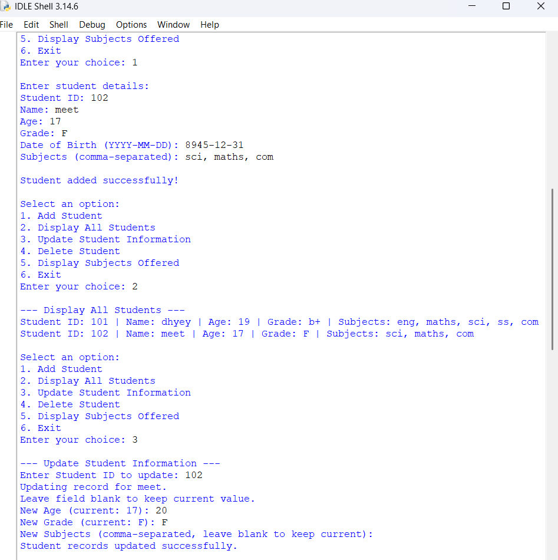
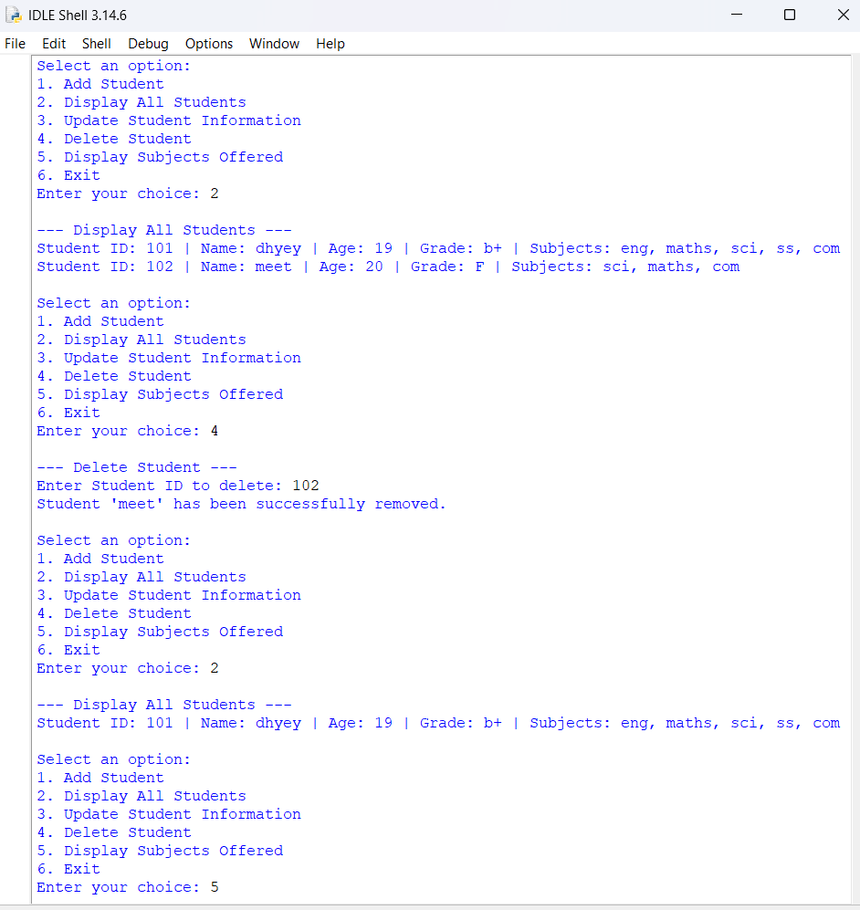
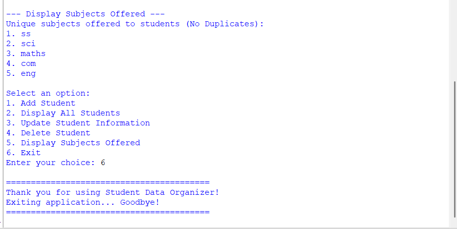

<div align="center">

# 🎓 Student Data Organizer

### A Simple, Menu-Driven CLI App to Manage Student Records in Python


*A practical, beginner-friendly Python project demonstrating core data structures and CRUD operations through an interactive command-line interface.*

</div>

---

## 📑 Table of Contents

- [📖 Project Overview](#-project-overview)
- [✨ Key Features](#-key-features)
- [🛠️ Technologies Used](#️-technologies-used)
- [🧠 Python Concepts Demonstrated](#-python-concepts-demonstrated)
- [📁 Project Structure](#-project-structure)
- [⚙️ Installation](#️-installation)
- [🚀 Usage](#-usage)
- [📸 Output Screenshots](#-output-screenshots)
- [🎯 Learning Outcomes](#-learning-outcomes)
- [🔮 Future Improvements](#-future-improvements)
- [👤 Author](#-author)

---

## 📖 Project Overview

**Student Data Organizer** is a menu-driven, command-line application built in **Python 3** that allows users to efficiently manage student records. It's designed as a hands-on demonstration of Python's core data structures — lists, dictionaries, tuples, and sets — combined into a single, interactive tool.

The application allows users to:

- ➕ Add new student records
- 📋 Display all student records
- ✏️ Update existing student information
- 🗑️ Delete student records
- 📚 Display all unique subjects offered
- 🚪 Exit the application safely

This project is ideal for beginners looking to strengthen their understanding of Python fundamentals through a real, working CLI tool.

---

## ✨ Key Features

- 📚 **Add Student Records** — Capture ID, name, age, grade, date of birth, and subjects
- 👨‍🎓 **Display All Students** — View a clean, formatted list of every student on record
- ✏️ **Update Student Information** — Edit age, grade, or subjects while keeping the rest unchanged
- 🗑️ **Delete Student Records** — Remove a student by ID with automatic subject list cleanup
- 📖 **Display Unique Subjects** — See every subject currently offered, with duplicates removed
- 🔄 **Menu-Driven Interface** — Simple numbered menu for effortless navigation
- ✅ **Input Validation** — Basic safeguards to keep data entry smooth
- 🐍 **Beginner-Friendly Python Code** — Clean, readable, and well-structured logic
- 💻 **Simple Command-Line Interface** — No dependencies, runs anywhere Python does

---

## 🛠️ Technologies Used

| Technology | Purpose |
|---|---|
| 🐍 Python 3 | Core programming language |
| 💻 Command Line Interface (CLI) | User interaction |

---

## 🧠 Python Concepts Demonstrated

- 📃 Lists
- 🔑 Dictionaries
- 🔒 Tuples
- 🧮 Sets
- 🔁 Loops
- 🔀 Conditional Statements
- 🔄 CRUD Operations
- 🗃️ Data Management
- ⌨️ User Input Handling
- 🔤 String Manipulation

---

## 📁 Project Structure

```text
python-project-3/
│── py_pr_3.py
│── output1.png
│── output2.png
│── output3.png
│── output4.png
│── README.md
```

---

## ⚙️ Installation

Follow these steps to get the project running locally:

**1. Clone the repository**
```bash
git clone https://github.com/dhyeykakadiya71-dotcom/python-project.git
```

**2. Navigate to the project directory**
```bash
cd "python project 3"
```

**3. Ensure Python 3 is installed**
```bash
python --version
```

**4. Run the program**
```bash
python py_pr_3.py
```

> 💡 **Note:** No external libraries are required — this project runs using only Python's standard library.

---

## 🚀 Usage

Once launched, the application presents a simple numbered menu:

```
=========================================
  Welcome to the Student Data Organizer! 
=========================================

Select an option:
1. Add Student
2. Display All Students
3. Update Student Information
4. Delete Student
5. Display Subjects Offered
6. Exit
```

1. **Start the application** by running `py_pr_3.py`
2. **Select an option** from the main menu by entering a number (1–6)
3. **Add student information** — ID, name, age, grade, date of birth, and subjects
4. **Display all students** to view every stored record
5. **Update student records** by entering a Student ID and providing new values (or leaving fields blank to keep them unchanged)
6. **Delete records** by entering the Student ID you wish to remove
7. **View all unique subjects** currently offered across all students
8. **Exit the application** safely using option 6

---

## 📸 Output Screenshots

### Main Menu


### Add Student


### Display Students


### Subjects Offered


---

## 🎯 Learning Outcomes

Building this project reinforced the following concepts:

- ✅ Practical use of Python data structures (lists, dictionaries, tuples, sets)
- ✅ Implementing full CRUD (Create, Read, Update, Delete) operations
- ✅ Designing menu-driven program flow
- ✅ Problem-solving using core Python logic
- ✅ Organizing and managing structured data
- ✅ Building a complete console application from scratch

---

## 🔮 Future Improvements

Planned enhancements to extend this project further:

- 💾 Save records to a file for persistent storage
- 🗄️ Database integration (SQLite/MySQL)
- 🔍 Search student by ID or Name
- 📊 Sort student records by various fields
- 📄 Export records to CSV or Excel
- 🔐 Login authentication for secure access
- 🖥️ GUI version using Tkinter or PyQt
- 🌐 Web version using Flask or Django

---

## 👤 Author

<div align="center">

**Dhyey Kakadiya**

[](https://github.com/dhyeykakadiya71-dotcom/python-project/tree/main/python%20project%203)

⭐ *If you found this project useful, consider giving it a star!* ⭐

</div>
