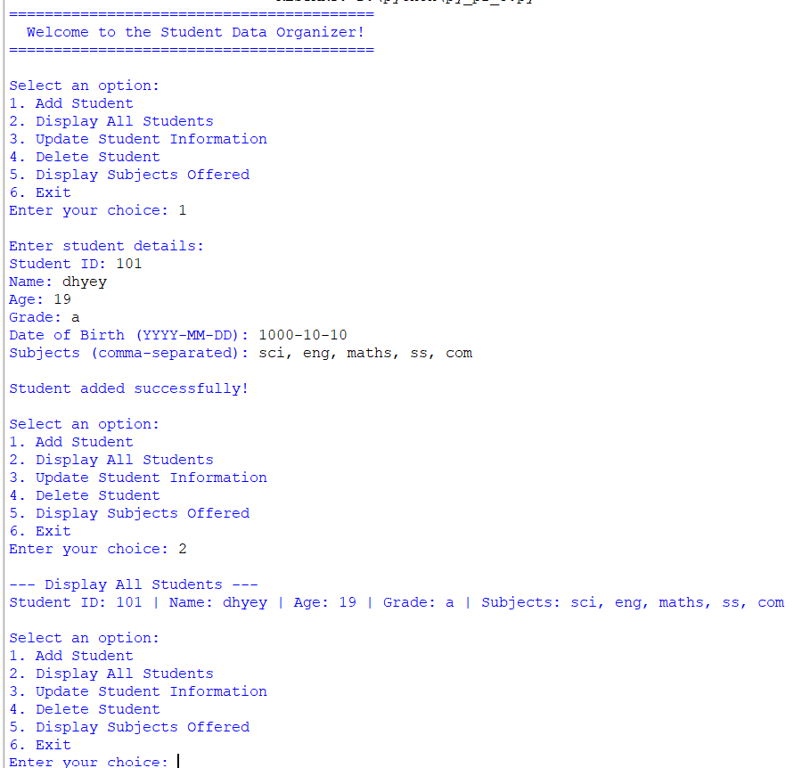

<div align="center">

# 🎓 Student Data Organizer

### A simple, menu-driven Command Line Application to manage student records using core Python data structures.


</div>

---

## 📑 Table of Contents

- [📖 About the Project](#-about-the-project)
- [✨ Features](#-features)
- [🛠️ Technologies Used](#️-technologies-used)
- [🧠 Python Concepts Used](#-python-concepts-used)
- [📁 Project Structure](#-project-structure)
- [📸 Output Screenshot](#-output-screenshot)
- [⚙️ Installation](#️-installation)
- [▶️ How to Run](#️-how-to-run)
- [🔄 Program Workflow](#-program-workflow)
- [🎯 Learning Objectives](#-learning-objectives)
- [🚀 Future Improvements](#-future-improvements)
- [👤 Author](#-author)
- [📜 License](#-license)

---

## 📖 About the Project

**Student Data Organizer** is a command-line application built using **Python** that allows users to manage student records through a simple and intuitive **menu-driven interface**.

This project demonstrates the practical use of core Python data structures — **Lists, Dictionaries, Tuples, and Sets** — while performing complete **CRUD (Create, Read, Update, Delete)** operations on student data.

With this program, users can:

- ➕ Add new student records
- 📋 Display all student information
- ✏️ Update existing student details
- 🗑️ Delete student records
- 📚 Display all unique subjects offered
- 🚪 Exit the application safely

---

## ✨ Features

- 🖥️ Menu-driven Command Line Interface (CLI)
- ➕ Add student records
- 📋 Display all students
- ✏️ Update student information
- 🗑️ Delete student records
- 🔒 Store immutable student information using **tuples**
- 🗂️ Store student details using **dictionaries**
- 📃 Maintain student records using **lists**
- 🔑 Display unique subjects using **sets**
- 👶 Beginner-friendly and well-structured Python code

---

## 🛠️ Technologies Used

- 🐍 Python 3
- 💻 Command Line Interface (CLI)

---

## 🧠 Python Concepts Used

| Concept | Description |
|----------|-------------|
| 📃 Lists | Used to store and manage multiple student records |
| 🗂️ Dictionaries | Used to store individual student details as key-value pairs |
| 🔒 Tuples | Used to store immutable student information |
| 🔑 Sets | Used to display unique subjects without duplicates |
| 🔁 Loops | Used to repeat menu operations until the user exits |
| 🔀 Conditional Statements | Used to handle different menu choices |
| ⌨️ User Input | Used to interact with the user via the terminal |
| 🔄 CRUD Operations | Core logic for Create, Read, Update, and Delete functionality |
| 🧩 Functions | Used to organize code into reusable blocks |
| 🗃️ Data Management | Used to structure and maintain student data efficiently |

---

## 📁 Project Structure

```text
python-project-3/
│── py_pr_3.py
│── output.png
│── README.md
```

---

## 📸 Output Screenshot



---

## ⚙️ Installation

Follow these simple steps to set up the project on your local machine:

1. **Clone the repository**
   ```bash
   git clone https://github.com/dhyeykakadiya71-dotcom/python-project.git
   ```

2. **Open the project folder**
   ```bash
   cd "python-project/python project 3"
   ```

3. **Make sure Python 3 is installed**
   ```bash
   python --version
   ```

4. **Run the program from the terminal** (see instructions below 👇)

---

## ▶️ How to Run

Run the following command in your terminal:

```bash
python py_pr_3.py
```

---

## 🔄 Program Workflow

1. 🚀 Launch the program.
2. 📋 Choose an option from the menu.
3. ➕✏️🗑️ Add, display, update, or delete student records.
4. 📚 View all unique subjects offered.
5. 🚪 Exit the application.

---

## 🎯 Learning Objectives

This project demonstrates:

- 🔄 CRUD operations
- 🧠 Python data structures (Lists, Dictionaries, Tuples, Sets)
- 🖥️ Menu-driven programming
- 🗃️ Data organization
- ⌨️ User interaction through the terminal
- 🏗️ Basic software development concepts

---

## 🚀 Future Improvements

Planned enhancements for future versions:

- 💾 Save student records in a file or database
- 🔍 Search students by name
- 🔃 Sort student records
- 📊 Export data to CSV or Excel
- 🔐 Add login authentication
- 🖱️ Build a GUI version using Tkinter or PyQt

---

## 👤 Author

**Dhyey Kakadiya**

🔗 GitHub: [dhyeykakadiya71-dotcom](https://github.com/dhyeykakadiya71-dotcom/python-project/tree/main/python%20project%203)

---

## 📜 License

This project is licensed under the **MIT License** — feel free to use, modify, and share it for learning purposes.

---

<div align="center">

### ⭐ If you found this project helpful, consider giving it a star!

</div>
